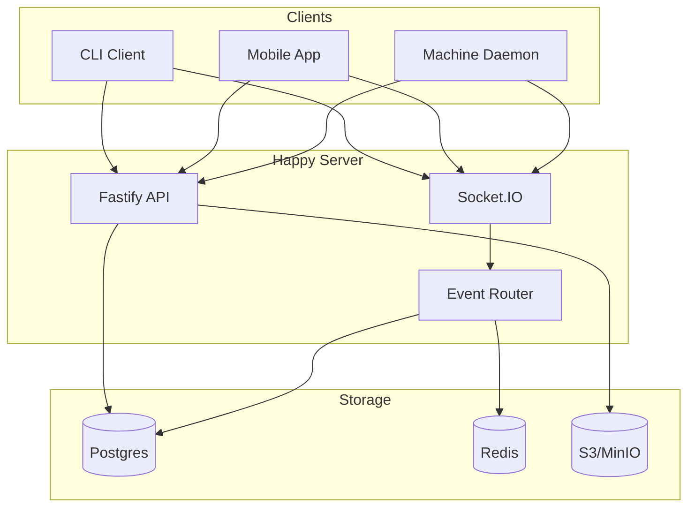
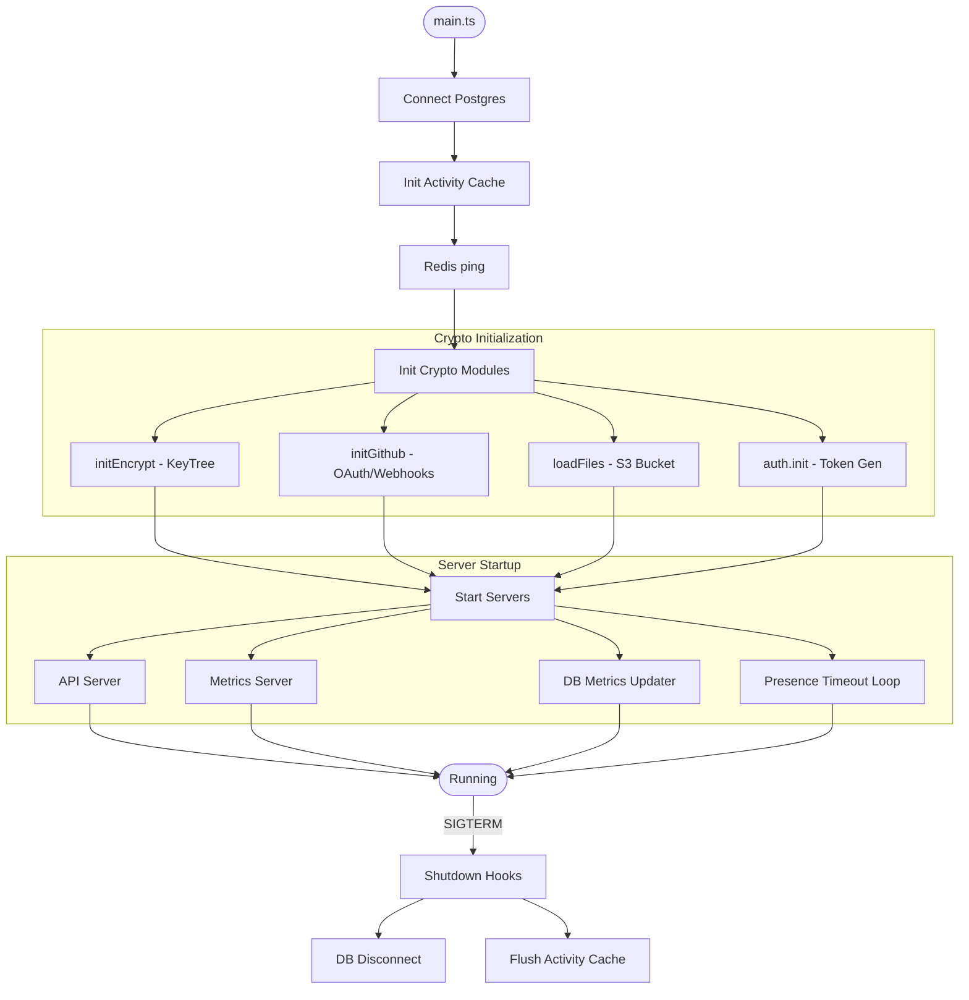
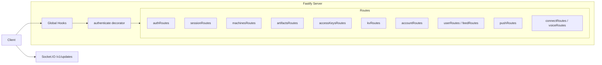
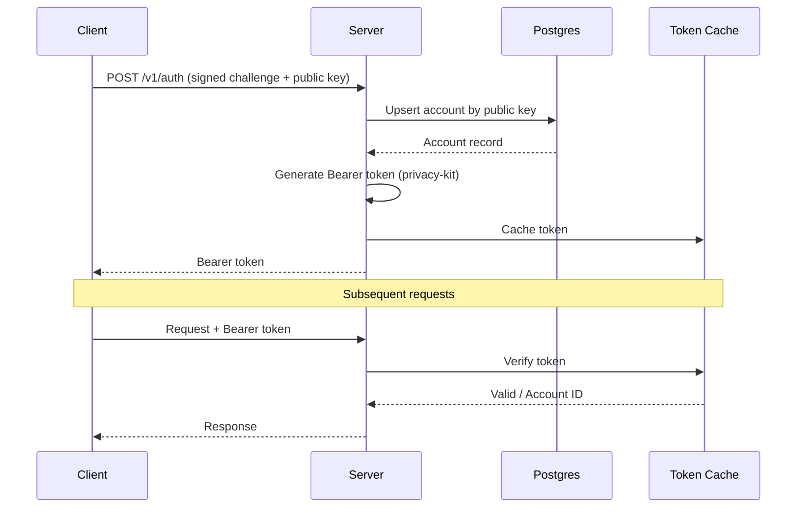
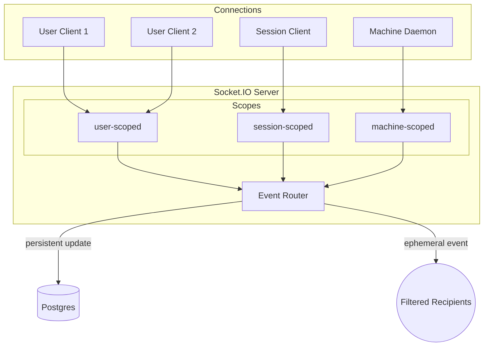
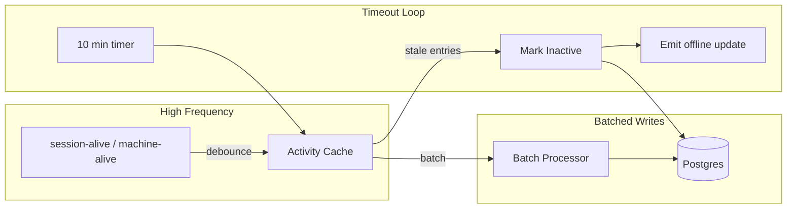
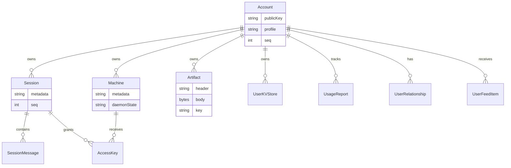
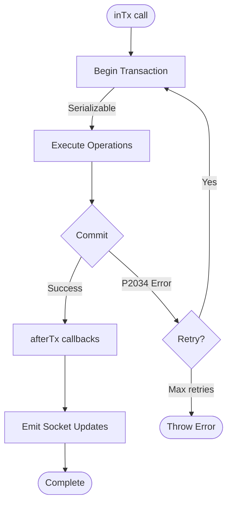
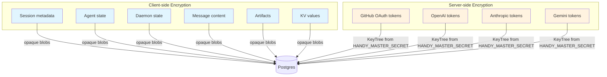

# 後端架構

本文件說明 `packages/happy-server` 中實作的 Happy 後端結構，聚焦於伺服器的接線方式、資料在系統中的流向，以及各子系統所負責的職責。

## 系統概覽

## 快速概覽
- 執行環境：Node.js + Fastify 處理 HTTP，Socket.IO 處理即時通訊。
- 資料庫：透過 Prisma 使用 Postgres。
- 快取／訊息匯流排：Redis 客戶端已初始化（目前僅進行 ping）。
- Blob 儲存：S3 相容（MinIO）用於上傳的檔案資產。
- 加密：privacy-kit 負責驗證令牌與加密的服務令牌。
- 指標：Prometheus 風格的 `/metrics` 伺服器 + 每請求 HTTP 指標。

## 程序生命週期
進入點：`packages/happy-server/sources/main.ts`。

啟動順序：
1. 連線 Postgres（`db.$connect()`）。
2. 初始化活動快取（即時狀態）並進行 Redis 連線檢查（`redis.ping()`）。
3. 初始化加密模組：
   - `initEncrypt()` 從 `HANDY_MASTER_SECRET` 衍生 KeyTree。
   - `initGithub()` 若環境變數存在，則設定 GitHub App／Webhook。
   - `loadFiles()` 驗證 S3 儲存桶存取。
   - `auth.init()` 準備令牌產生器／驗證器。
4. 啟動 API 伺服器（`startApi()`）、指標伺服器、資料庫指標更新器，以及即時狀態逾時迴圈。
5. 持續運行直到收到關閉訊號。

關閉掛鉤已針對資料庫中斷連線與活動快取清空完成註冊。

## API 層
`sources/app/api/api.ts` 中的 `startApi()` 負責接線 HTTP 伺服器：
- 搭配 Zod 驗證器／序列化器的 Fastify 實例。
- 用於監控與錯誤處理的全域掛鉤。
- 驗證 Bearer 令牌的 `authenticate` 裝飾器。
- `sources/app/api/routes` 下的路由模組。
- 附加於 `/v1/updates` 的 Socket.IO 伺服器。

HTTP 路由依功能領域組織：
- 驗證（`authRoutes`）
- 工作階段 + 訊息（`sessionRoutes`）
- 機器（`machinesRoutes`）
- 成品（`artifactsRoutes`）
- 存取金鑰（`accessKeysRoutes`）
- 鍵值儲存（`kvRoutes`）
- 帳號 + 使用量（`accountRoutes`）
- 社交 + 動態（`userRoutes`、`feedRoutes`）
- 推播令牌（`pushRoutes`）
- 整合（`connectRoutes`、`voiceRoutes`）
- 版本檢查（`versionRoutes`）
- 僅開發用日誌（`devRoutes`）

## 驗證與令牌

後端不儲存密碼，改以以下方式運作：
- 客戶端透過公鑰使用簽署挑戰（`/v1/auth`）進行驗證。
- 伺服器以公鑰對應更新帳號資料，並回傳 Bearer 令牌。
- 令牌由 privacy-kit 使用 `HANDY_MASTER_SECRET` 產生與驗證。
- 令牌快取於記憶體中以加速驗證。

GitHub OAuth 使用短效「臨時」令牌保護回呼，與一般驗證流程分開。

## 即時同步架構

### 連線類型
Socket.IO 連線依範疇標記：
- `user-scoped`：接收所有使用者更新。
- `session-scoped`：僅接收特定工作階段的更新。
- `machine-scoped`：用於機器狀態的 Daemon 連線。

### 事件路由器
`EventRouter`（`sources/app/events/eventRouter.ts`）維護每位使用者的連線集合，並路由：
- **持久性 `update` 事件**：由資料庫支撐的變更，帶有使用者層級的單調遞增 `seq`。
- **臨時事件**：不被持久化的即時狀態／使用量訊號。

路由器實作接收者篩選器，確保更新僅傳送至感興趣的連線（例如，所有工作階段監聽器或特定機器）。

### 更新序號
- `Account.seq` 為每位使用者的更新計數器，由 `allocateUserSeq` 遞增，並作為 `UpdatePayload.seq`。
- 工作階段與成品維護各自的 `seq` 以進行物件層級的排序。

## 即時狀態與活動

即時狀態由 `sources/app/presence` 處理：
- `session-alive` 與 `machine-alive` 事件在記憶體中防抖（ActivityCache）。
- 資料庫寫入以批次方式進行，以降低寫入負載。
- 逾時迴圈在靜默 10 分鐘後將工作階段／機器標記為非活躍，並發送離線臨時更新。

此設計將高頻率的即時狀態更新與持久儲存更新分開處理。

## 儲存與持久化
### 資料庫（Prisma）
Prisma 模型位於 `prisma/schema.prisma`。主要資料表：

- `Account`：公鑰身份、個人資料、設定、seq 計數器。
- `Session` + `SessionMessage`：加密的工作階段元資料與訊息 Blob。
- `Machine`：加密的機器元資料 + Daemon 狀態。
- `Artifact`：加密的標頭／本文 + 每個成品的金鑰。
- `AccessKey`：加密的每工作階段每機器存取金鑰。
- `UserKVStore`：帶有樂觀版本控制的加密值。
- `UsageReport`：按工作階段／金鑰的使用量彙總。
- `UserRelationship` + `UserFeedItem`：社交圖譜與動態。

### 交易與重試

`inTx()` 以下列方式包裝 Prisma 交易：
- 可序列化隔離。
- 在 `P2034`（序列化失敗）時自動重試。
- `afterTx()` 於提交後發送 socket 更新。

此模式用於多寫入操作，例如批次 KV 修改與工作階段刪除。

### Blob 儲存（S3/MinIO）
伺服器使用 S3 相容儲存來存放使用者資產（例如頭像）：
- `storage/files.ts` 設定 S3 客戶端。
- `uploadImage` 處理並儲存檔案，並將元資料寫入 `UploadedFile`。
- 公開 URL 由 `S3_PUBLIC_URL` 衍生。

### Redis
Redis 客戶端在 `main.ts` 中初始化，並於啟動時進行 ping。若有需要，可擴展用於快取或發佈／訂閱。

## 資料機密性模型

- 工作階段元資料、代理狀態、Daemon 狀態及訊息內容均以不透明加密字串或 Blob 方式儲存。
- 成品與 KV 值加密後以 base64 編碼於傳輸中。
- 伺服器僅使用從 `HANDY_MASTER_SECRET` 衍生的 KeyTree 來加密／解密**服務令牌**（GitHub OAuth 令牌、供應商令牌）。

## 整合
- **GitHub**：OAuth 連結 + Webhook 驗證，若設定環境變數則為可選。
- **AI 供應商**：`openai`、`anthropic`、`gemini` 的加密令牌儲存。
- **語音**：RevenueCat 訂閱檢查 + ElevenLabs 令牌鑄造。
- **推播令牌**：儲存以備後續通知傳送使用。

## 可觀測性
- `/health` 路由檢查資料庫連線。
- 指標伺服器公開 `/metrics` 供 Prometheus 使用。
- HTTP 請求計數器與延遲直方圖透過 Fastify 掛鉤擷取。
- WebSocket 事件計數器與連線量表位於 `metrics2.ts`。

## 關鍵實作參考
- 進入點：`packages/happy-server/sources/main.ts`
- API 伺服器：`packages/happy-server/sources/app/api/api.ts`
- Socket 伺服器：`packages/happy-server/sources/app/api/socket.ts`
- 事件路由：`packages/happy-server/sources/app/events/eventRouter.ts`
- 即時狀態：`packages/happy-server/sources/app/presence`
- 儲存：`packages/happy-server/sources/storage`
- Prisma 結構描述：`packages/happy-server/prisma/schema.prisma`
