# CLI 架構

本文件說明 Happy CLI（`packages/happy-cli`）及其 Daemon。CLI 既是互動式工具，也是在後台執行的工作階段管理員，負責將機器狀態與伺服器保持同步。

## 系統概覽

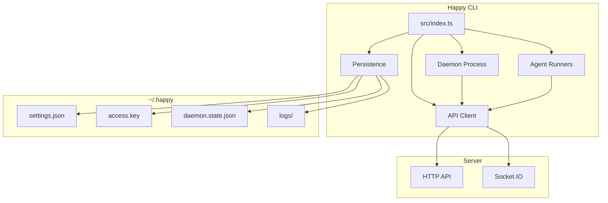

## 高層次架構
- **進入點：** `src/index.ts` 解析子命令並路由執行。
- **API 客戶端：** `src/api` 處理 HTTP + Socket.IO、加密與 RPC。
- **Daemon：** `src/daemon` 在後台執行，產生工作階段並維護機器狀態。
- **持久化／設定：** `src/persistence.ts` + `src/configuration.ts` 管理 `~/.happy` 下的本地狀態。
- **代理：** `src/claude`、`src/codex`、`src/gemini` 提供供應商特定的執行器。

## CLI 進入流程

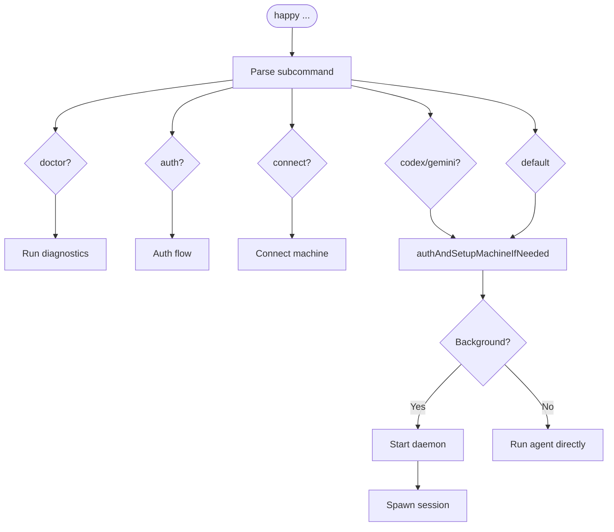

`src/index.ts` 是 CLI 路由器，負責：
- 解析子命令（`doctor`、`auth`、`connect`、`codex`、`gemini` 及預設執行流程）。
- 在需要時確保驗證與機器設定（`authAndSetupMachineIfNeeded`）。
- 根據子命令／上下文啟動 Daemon 或直接執行代理。

## 本地狀態與設定

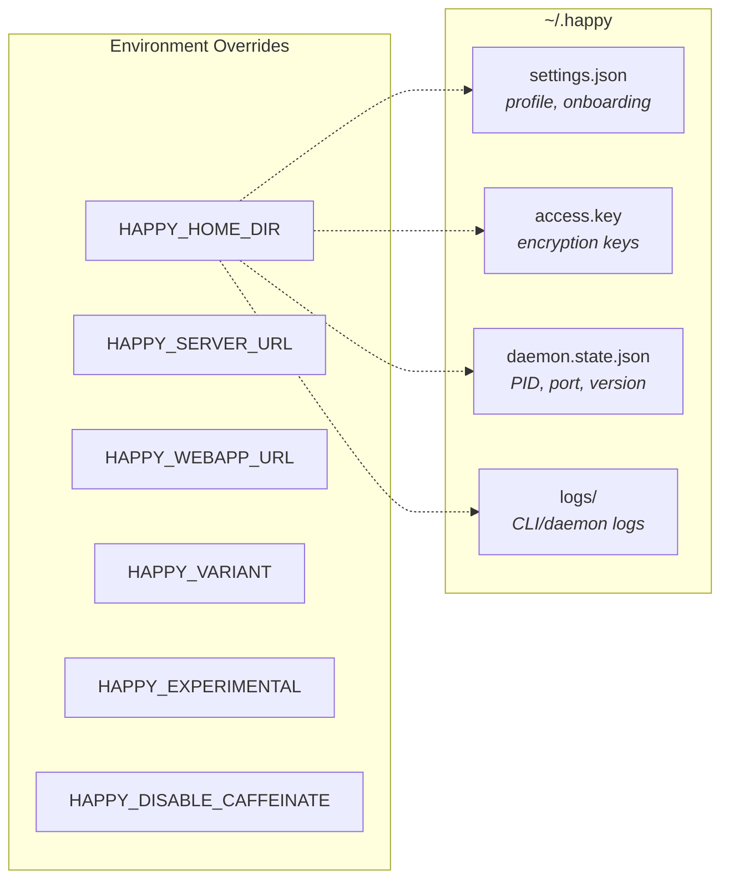

本地狀態存放於 `~/.happy`（或 `HAPPY_HOME_DIR`）：
- `settings.json`：上線流程與個人資料設定（經過驗證／遷移）。
- `access.key`：用於加密／驗證的本地金鑰材料。
- `daemon.state.json`：Daemon PID + 控制埠 + 版本。
- `logs/`：CLI／Daemon 日誌。

設定位於 `src/configuration.ts`：
- `HAPPY_SERVER_URL` 與 `HAPPY_WEBAPP_URL` 可覆蓋預設值。
- `HAPPY_VARIANT`、`HAPPY_EXPERIMENTAL`、`HAPPY_DISABLE_CAFFEINATE` 控制行為。

## API 客戶端架構

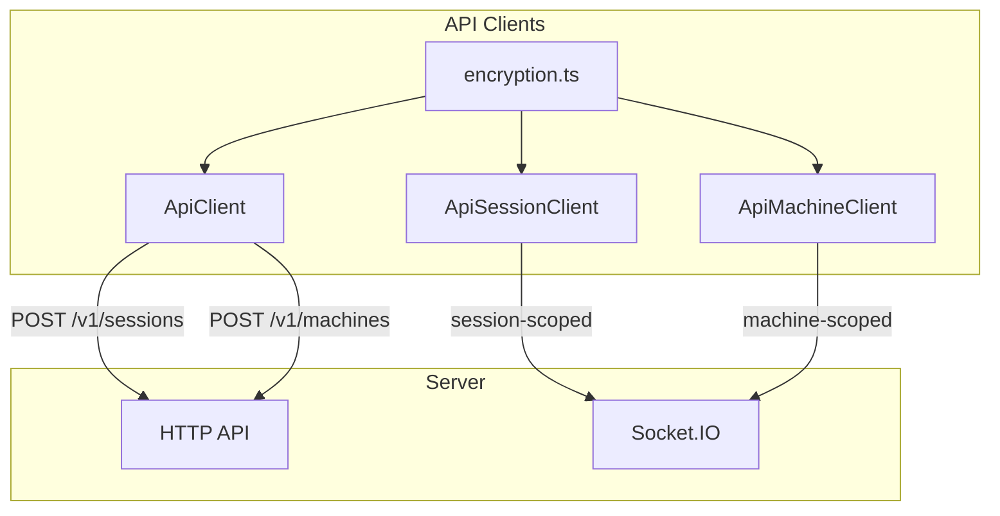

### HTTP
`ApiClient`（`src/api/api.ts`）處理：
- 工作階段建立（`POST /v1/sessions`）並附加加密的元資料／狀態。
- 機器註冊（`POST /v1/machines`）並附加加密的元資料／Daemon 狀態。
- 透過 `ApiSessionClient` 與 `ApiMachineClient` 進行的其他 CRUD 操作。

### WebSocket

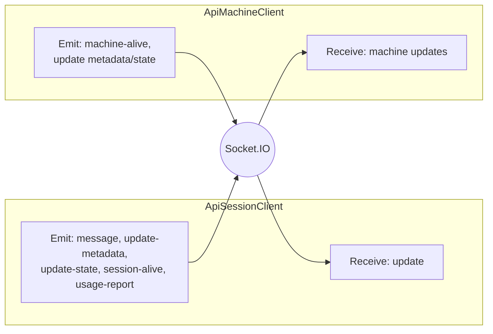

`ApiSessionClient`（`src/api/apiSession.ts`）以**工作階段範疇**客戶端連線至 Socket.IO：
- 接收 `update` 事件並解密訊息內容。
- 發送 `message`、`update-metadata`、`update-state`、`session-alive` 及 `usage-report`。

`ApiMachineClient`（`src/api/apiMachine.ts`）以**機器範疇**客戶端連線：
- 發送 `machine-alive` 心跳。
- 以樂觀並行控制更新機器元資料／Daemon 狀態。
- 接收機器更新並在本地合併。

### 加密

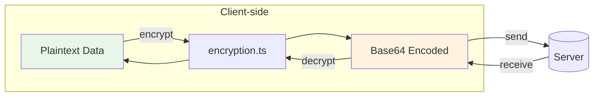

CLI 使用 `src/api/encryption.ts` 在資料離開機器之前對客戶端內容進行加密。
- 工作階段元資料、代理狀態、訊息、機器狀態、成品及 KV 值均在客戶端加密。
- 傳輸編碼為 base64；詳見 `encryption.md`。

## Daemon 架構

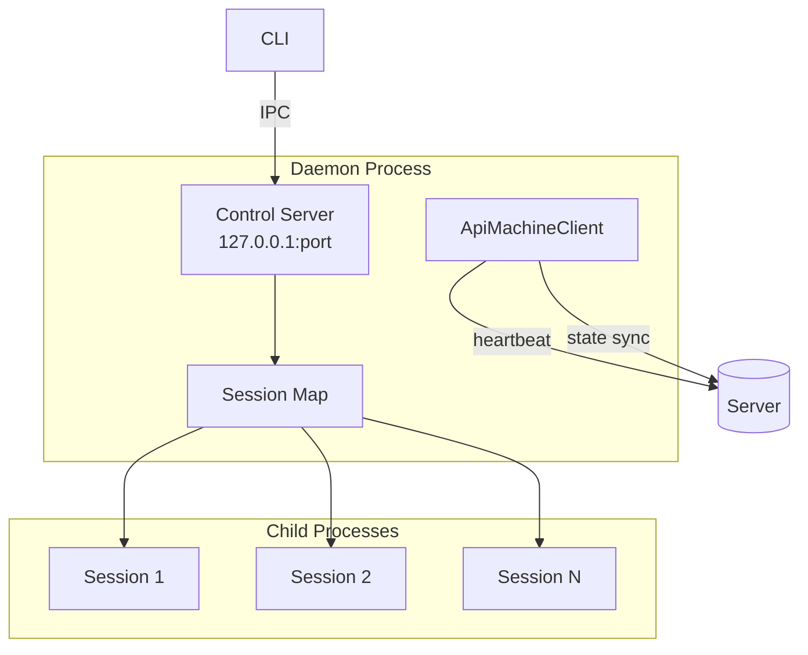

Daemon 是長期存活的程序，負責在後台執行工作階段並維護機器即時狀態。

### 生命週期

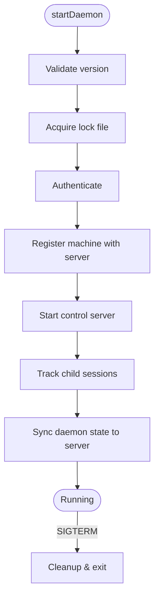

1. `startDaemon()` 驗證執行中的版本並取得鎖定檔案。
2. 進行驗證並向伺服器註冊機器。
3. 啟動本地**控制伺服器**進行 IPC。
4. 維護已追蹤子工作階段的對應表，並在伺服器上更新 Daemon 狀態。

### 控制伺服器（本地 IPC）

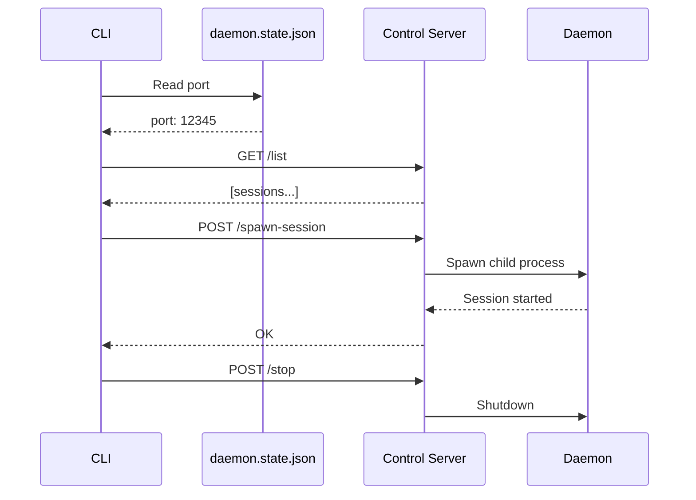

`startDaemonControlServer()`（`src/daemon/controlServer.ts`）在 `127.0.0.1` 上執行 HTTP 伺服器，並公開：
- `/list`（列出活躍工作階段）
- `/stop-session`
- `/spawn-session`
- `/stop`（關閉 Daemon）
- `/session-started`（工作階段自我回報）

CLI 透過 `controlClient.ts` 與此伺服器通訊，使用儲存於 `daemon.state.json` 中的埠號。

### 工作階段產生

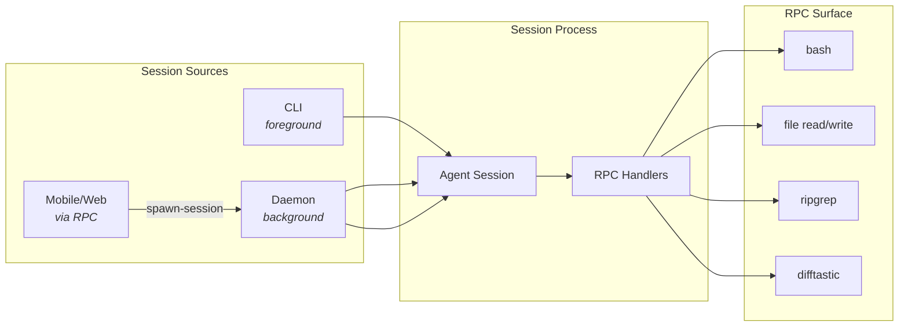

工作階段可由以下方式啟動：
- CLI 直接啟動（前景）。
- Daemon 啟動（後台）。
- 透過 RPC 的遠端請求（來自行動裝置／網頁，透過機器連線）。

Daemon 工作階段產生使用 `registerCommonHandlers` 公開受控的 RPC 介面（Shell 命令、檔案操作、搜尋／差異輔助工具）。

### 機器狀態

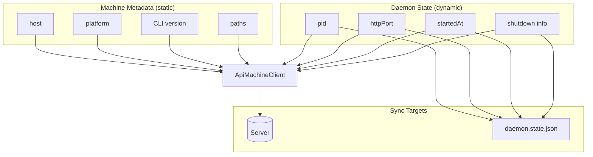

- **機器元資料**為靜態資訊（主機、平台、CLI 版本、路徑）。
- **Daemon 狀態**為動態資訊（pid、httpPort、startedAt、關閉資訊）。

Daemon 透過 `ApiMachineClient` 更新這些資訊，並將本地狀態鏡像至 `daemon.state.json` 以供控制／診斷使用。

## RPC 與工具橋接

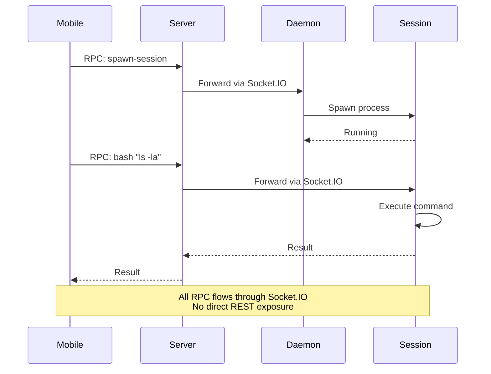

RPC 用於透過 Socket.IO 連線發送命令：
- 工作階段註冊 RPC 處理器（例如 `bash`、檔案讀寫、`ripgrep`、`difftastic`）。
- Daemon 註冊 spawn-session 處理器，讓伺服器／行動客戶端能要求啟動本地工作階段。

此機制讓伺服器與行動客戶端能驅動本地操作，而無需公開廣泛的 REST 介面。

## 實作參考
- CLI 進入點：`packages/happy-cli/src/index.ts`
- Daemon：`packages/happy-cli/src/daemon`
- 控制伺服器／客戶端：`packages/happy-cli/src/daemon/controlServer.ts`、`packages/happy-cli/src/daemon/controlClient.ts`
- API 客戶端：`packages/happy-cli/src/api`
- 持久化：`packages/happy-cli/src/persistence.ts`
- 設定：`packages/happy-cli/src/configuration.ts`
